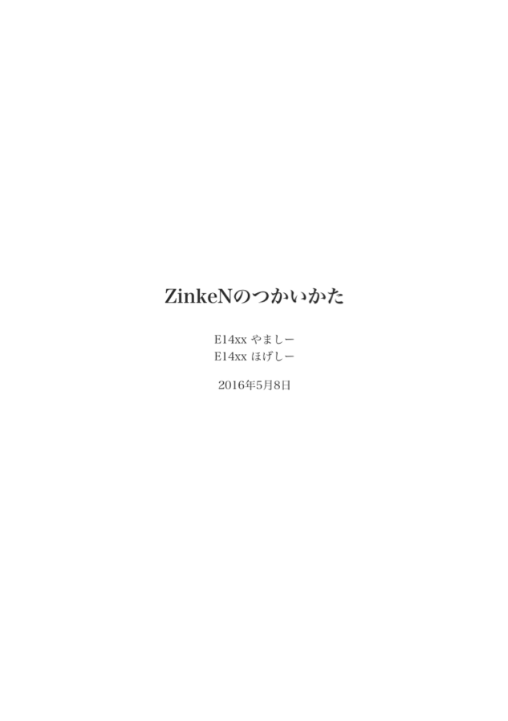
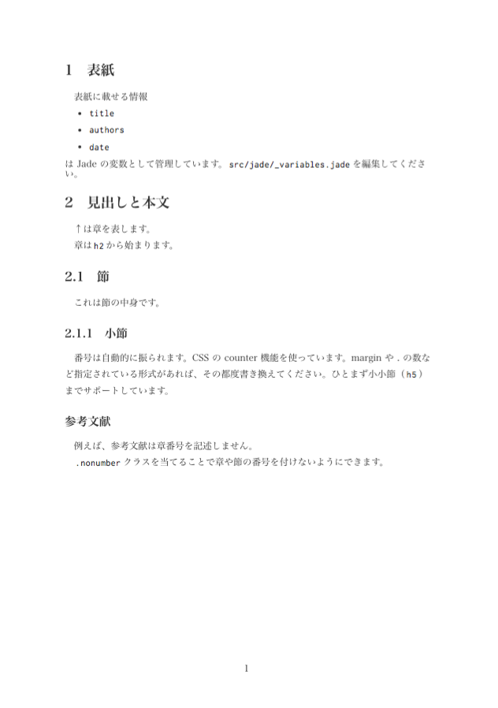
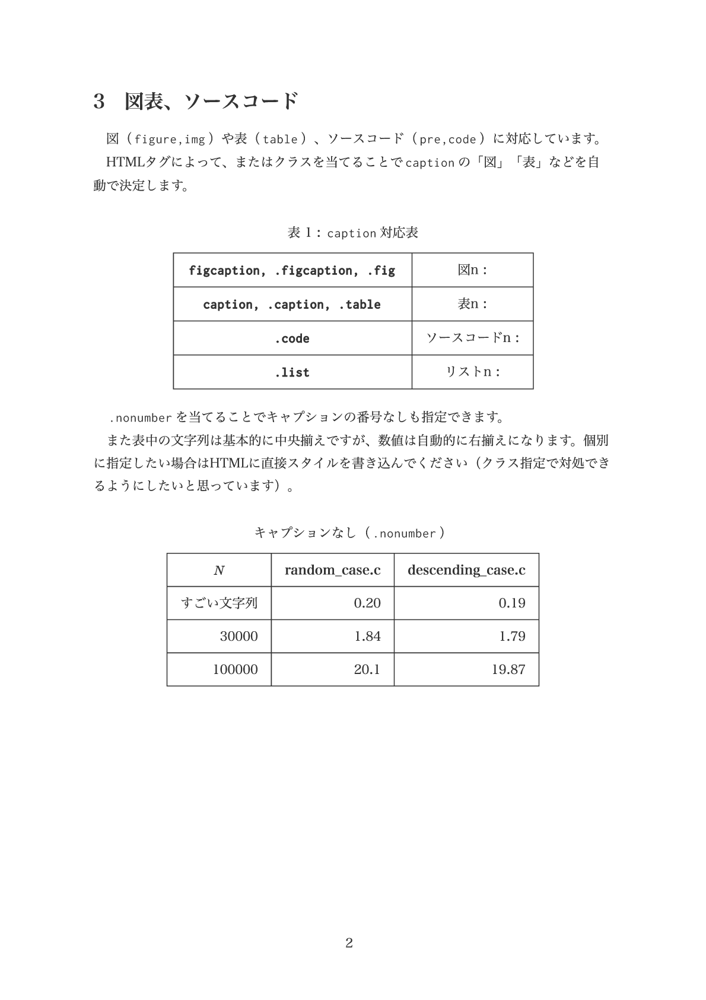
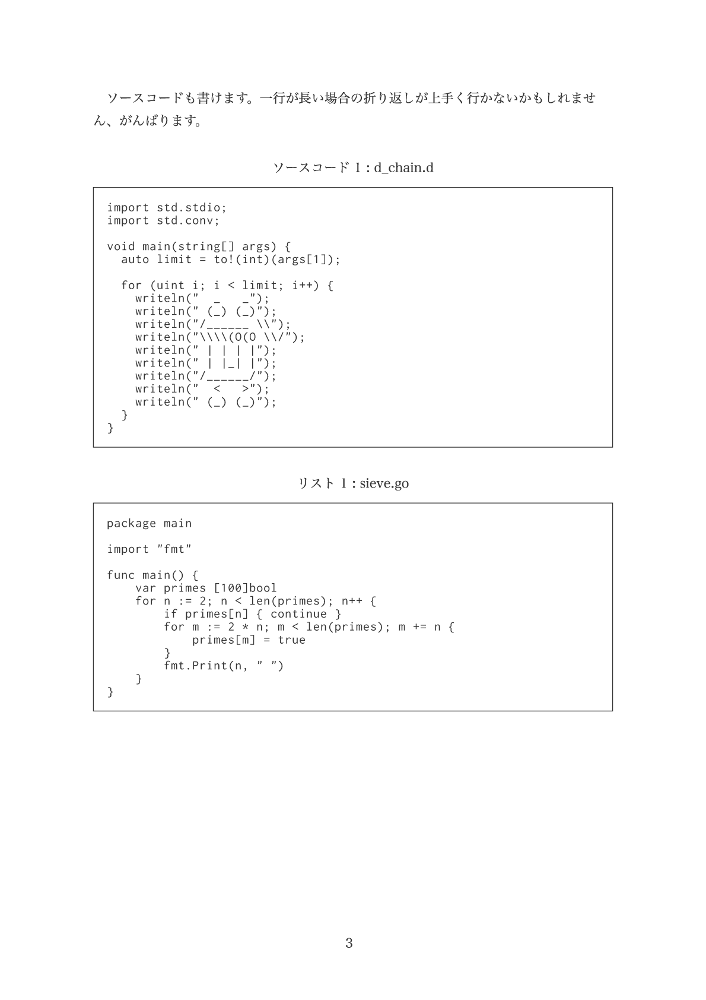
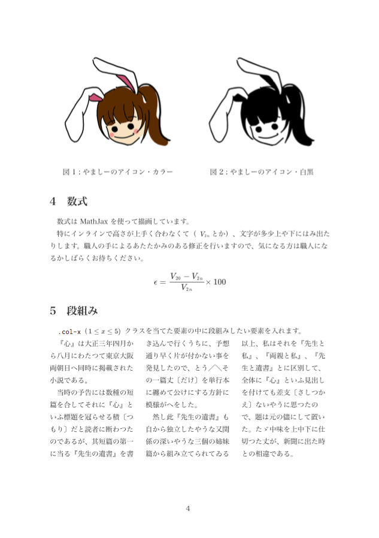

# ZinkeN v0.1.0

**TeXを捨てて人権を得たい**

## これはなに

TeX の導入に苦しむ人に人権を得て欲しいと思って作った、フロントエンドの技術（主に HTML CSS JS）だけでレポートやドキュメントを書くためのテンプレ。

## つかいかた

[Node.js](https://nodejs.org/en/) をインストールします。

```
# このソースコードを手元にもってきます。
git clone https://github.com/yamasy1549/ZinkeN.git
(or git clone git@github.com:yamasy1549/ZinkeN.git)

# package.json 内のパッケージをインストールします。
npm install

# src/ 内のファイル変更を検知して Jade や SCSS などを自動コンパイルします。
gulp watch
```

```
# こんなのが出てくるので、一番上に書かれているURL（[http://localhost:3000](http://localhost:3000)）にアクセスします。

[BS] Access URLs:
 ------------------------------------
       Local: http://localhost:3000
    External: http://192.168.1.2:3002
 ------------------------------------
          UI: http://localhost:3001
 UI External: http://192.168.1.2:3003
 ```

## 書きかた

Jade と SCSS それから MathJax で書けるようになっています。

詳しくは [src/jade/index.jade](./src/jade/index.jade) を見てください。

印刷は…ブラウザからPDF吐くかそのまま印刷するか…かな…












[上のPDF見本](https://github.com/yamasy1549/ZinkeN/files/253977/ZinkeN.pdf)


# これからがんばります

丸一日ゼロから作ったのでまだまだできないことがいっぱいあります。汚い部分もいっぱいあるけど、人権を得てレポートが書けるようにこれからがんばります！！！

よろしければ issue や pull req などお願いします :pray:

# thx

[@yurikazuna929](https://github.com/yurikazuna929)
